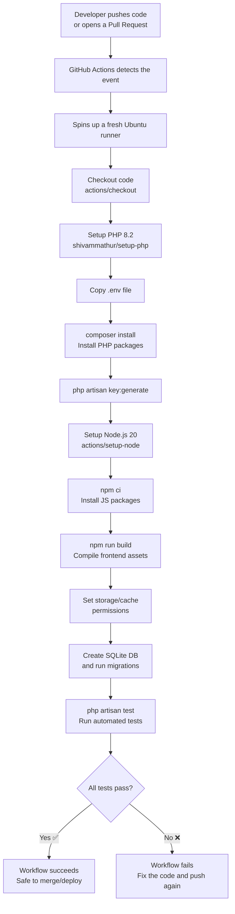

<p align="center"><a href="https://laravel.com" target="_blank"></a></p>

<p align="center">
<a href="https://github.com/laravel/framework/actions"></a>
<a href="https://packagist.org/packages/laravel/framework"></a>
<a href="https://packagist.org/packages/laravel/framework"></a>
<a href="https://packagist.org/packages/laravel/framework"></a>
</p>

## About Laravel

Laravel is a web application framework with expressive, elegant syntax. We believe development must be an enjoyable and creative experience to be truly fulfilling. Laravel takes the pain out of development by easing common tasks used in many web projects, such as:

- [Simple, fast routing engine](https://laravel.com/docs/routing).
- [Powerful dependency injection container](https://laravel.com/docs/container).
- Multiple back-ends for [session](https://laravel.com/docs/session) and [cache](https://laravel.com/docs/cache) storage.
- Expressive, intuitive [database ORM](https://laravel.com/docs/eloquent).
- Database agnostic [schema migrations](https://laravel.com/docs/migrations).
- [Robust background job processing](https://laravel.com/docs/queues).
- [Real-time event broadcasting](https://laravel.com/docs/broadcasting).

Laravel is accessible, powerful, and provides tools required for large, robust applications.

---

## 🚀 CI/CD Automation with GitHub Actions

This project comes with an automated pipeline that tests the Laravel application every time code is pushed. This section explains everything from **zero knowledge** — what CI/CD is, what GitHub Actions are, and exactly what our workflow file does, step by step.

### 1. What is CI/CD?

**CI/CD** stands for **Continuous Integration / Continuous Delivery (or Deployment)**.

- **Continuous Integration (CI)** — Every time a developer pushes code, it is automatically **built and tested**. This catches bugs early, before they reach production.
- **Continuous Delivery/Deployment (CD)** — Once code passes all tests, it can be automatically **packaged and deployed** to a server, so the app stays up to date with minimal manual work.

**Why it matters:** Without CI/CD, a developer would have to manually install dependencies, run tests, and deploy every single time — slow and error-prone. CI/CD automates all of that.

```
Without CI/CD:  Write code → Manually test → Manually deploy → Hope nothing breaks 😬
With CI/CD:     Write code → Push to GitHub → Everything else happens automatically ✅
```

### 2. What is GitHub Actions?

**GitHub Actions** is GitHub's built-in automation tool. It lets you define **workflows** — a set of automated steps — that run whenever something happens in your repository (a push, a pull request, a schedule, etc.).

Key vocabulary:

| Term | Meaning |
|---|---|
| **Workflow** | A YAML file describing an automated process (e.g. `laravel.yml`). Lives in `.github/workflows/`. |
| **Event (`on:`)** | What triggers the workflow — e.g. `push`, `pull_request`. |
| **Job** | A group of steps that run together on one virtual machine (e.g. `test`). |
| **Step** | A single task inside a job — either a shell command or a reusable "action". |
| **Runner** | The virtual machine that executes the job (e.g. `ubuntu-latest`). |
| **Action** | A reusable, packaged step someone else built (e.g. `actions/checkout@v4`). |

### 3. Pre-built (Marketplace) GitHub Actions

Instead of writing raw shell scripts for everything, GitHub has a **Marketplace** full of ready-made, community-maintained "actions" you can drop into your workflow with a single line. This project uses three of them:

| Action | Purpose |
|---|---|
| [`actions/checkout@v4`](https://github.com/actions/checkout) | Downloads your repository's code onto the runner so later steps can use it. |
| [`shivammathur/setup-php@v2`](https://github.com/shivammathur/setup-php) | Installs a specific PHP version and extensions (this is our **PHP installation automation**). |
| [`actions/setup-node@v4`](https://github.com/actions/setup-node) | Installs Node.js and enables npm caching for faster builds. |

These save enormous time — nobody has to hand-write PHP installation scripts for Ubuntu; the pre-built action already knows how.

### 4. Our Custom GitHub Action Workflow

The custom workflow for this project lives at [`.github/workflows/laravel.yml`](.github/workflows/laravel.yml). It combines the pre-built actions above with our own custom shell commands (like `php artisan test`) to build a pipeline specific to **this Laravel project**.

It runs automatically on every `push` and `pull_request`, and performs 11 steps:

1. **Checkout code** – pull the latest repository code onto the runner.
2. **Setup PHP** – automatically install PHP 8.2 with the extensions Laravel needs (`mbstring`, `dom`, `fileinfo`, `mysql`, `sqlite3`).
3. **Copy `.env`** – create the environment config file from `.env.example`.
4. **Install Composer dependencies** – download all PHP/Laravel packages.
5. **Generate application key** – create Laravel's encryption key.
6. **Setup Node** – install Node.js 20 with npm caching.
7. **Install NPM dependencies** – download frontend packages.
8. **Build frontend assets** – compile CSS/JS with Vite.
9. **Set directory permissions** – allow Laravel to write to `storage` and `bootstrap/cache`.
10. **Run migrations** – create a temporary SQLite database and apply migrations.
11. **Run tests** – execute the full Laravel test suite with `php artisan test`.

If any step fails, the whole workflow is marked ❌ **failed**, and you can see exactly which step broke in the **Actions** tab of the GitHub repository.

### 5. Flowchart — How the Pipeline Works



### 6. Quick Start — Setting This Up Yourself (Zero Knowledge Friendly)

If you're starting a brand-new Laravel project and want the same automation:

1. Create a new Laravel project: `composer create-project laravel/laravel my-app`.
2. Push it to a GitHub repository.
3. In the project root, create the folder path `.github/workflows/`.
4. Add a file named `laravel.yml` inside that folder (this is your workflow file).
5. Define `on:` (when it should run), a `jobs:` section, and `steps:` (what to do) — see [`laravel.yml`](.github/workflows/laravel.yml) in this repo as a working example.
6. Commit and push. Open the **Actions** tab on GitHub — your pipeline will run automatically.
7. Every future push will now be automatically tested — no manual steps required.

---

## Learning Laravel

Laravel has the most extensive and thorough [documentation](https://laravel.com/docs) and video tutorial library of all modern web application frameworks, making it a breeze to get started with the framework. You can also check out [Laravel Learn](https://laravel.com/learn), where you will be guided through building a modern Laravel application.

If you don't feel like reading, [Laracasts](https://laracasts.com) can help. Laracasts contains thousands of video tutorials on a range of topics including Laravel, modern PHP, unit testing, and JavaScript. Boost your skills by digging into our comprehensive video library.

## Laravel Sponsors

We would like to extend our thanks to the following sponsors for funding Laravel development. If you are interested in becoming a sponsor, please visit the [Laravel Partners program](https://partners.laravel.com).

### Premium Partners

- **[Vehikl](https://vehikl.com)**
- **[Tighten Co.](https://tighten.co)**
- **[Kirschbaum Development Group](https://kirschbaumdevelopment.com)**
- **[64 Robots](https://64robots.com)**
- **[Curotec](https://www.curotec.com/services/technologies/laravel)**
- **[DevSquad](https://devsquad.com/hire-laravel-developers)**
- **[Redberry](https://redberry.international/laravel-development)**
- **[Active Logic](https://activelogic.com)**

## Contributing

Thank you for considering contributing to the Laravel framework! The contribution guide can be found in the [Laravel documentation](https://laravel.com/docs/contributions).

## Code of Conduct

In order to ensure that the Laravel community is welcoming to all, please review and abide by the [Code of Conduct](https://laravel.com/docs/contributions#code-of-conduct).

## Security Vulnerabilities

If you discover a security vulnerability within Laravel, please send an e-mail to Taylor Otwell via [taylor@laravel.com](mailto:taylor@laravel.com). All security vulnerabilities will be promptly addressed.

## License

The Laravel framework is open-sourced software licensed under the [MIT license](https://opensource.org/licenses/MIT).
